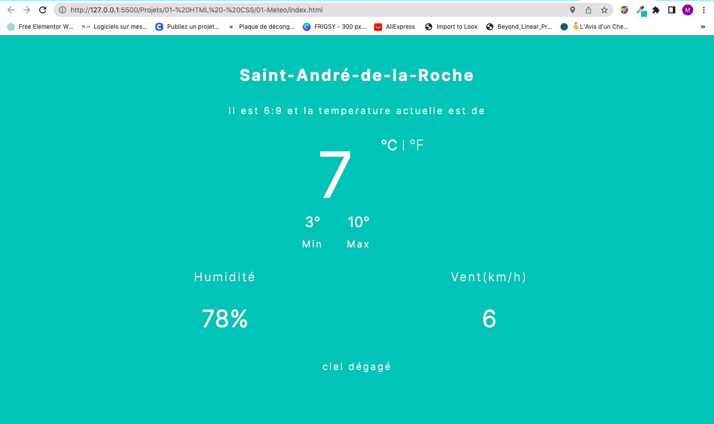

<!-- command Kv for live  -->


<!-- PROJECT SHIELDS -->
<!--
*** I'm using markdown "reference style" links for readability.
*** Reference links are enclosed in brackets [ ] instead of parentheses ( ).
*** See the bottom of this document for the declaration of the reference variables
*** for contributors-url, forks-url, etc. This is an optional, concise syntax you may use.
*** https://www.markdownguide.org/basic-syntax/#reference-style-links
-->


<!-- -->
<!-- HEADER -->
<br>
<header align="center">
   <br/> <br/>
  <h1 align="center">Projets Web</h1>
  <p align="center">
    Voici Quelques Projets Dans Le Domaine Du Développement Web (FrontEnd / BackEnd)
</p>
  </p>
</header>


<!-- TABLE OF CONTENTS -->

  <summary>Table De Matière</summary>
  <ol>
    <li>
        <a href="#">Présentations Des Projets</a>
        <ul>
            <li>
                <a href="#"> Weather App </a>
                <ul>
                    <li><a href="#">Pour Commencer</a></li>
                    <li><a href="#">Languages utilisés</a></li>
                     <li><a href="#Developement">Développement</a></li>
                    <li><a href="#contact">Interface IHM (UI / UX)</a></li>
                </ul>
            </li>
      </ul>
    </li>
    <li><a href="#contact">Contact</a></li>
  </ol>


<!-- ABOUT THE PROJECT -->
## Weather APP

 <br><div align="center"></div><br>


## Pour Commencer

Pour avoir ce projet veuillez copier le dossier comme suit:

```sh
  git clone https://github.com/mohamed063197/Developpement-Web.git

  ```
Cette commande va effectuer une copie sur votre répertoire local. Ensuite déplacez vous dans le dossier météo en effectuant la commande suivante:

```sh
  cd "Projets/01- HTML - CSS/01-Meteo"
  ```

## Languages utilisés

- 
  
- 	

- 

<p align="right">(<a href="#readme-top">Retour en haut</a>)</p>

## Développement

- Utilise un web service pour récupérer les données -**OpenWeatherMap API**-
  
- Récupérer de manière automatique la localisation de votre appareil.

## Interface IHM (UI / UX)

IHM de cette application sont faites avec figma. Voici le lien pour accéder au interfaces:
https://www.figma.com/file/fyGKKnB9rTLb9OPT3RloyU/Meteo?node-id=0%3A1&t=iGBmrWuilRssDEqY-1


<!-- CONTACT -->
## Contact

CHERIF MOHAMED - CherifMohamedAmineUnivFce@gmail.com

Lien Des Projets: [https://github.com/mohamed063197/Data-Scientist](https://github.com/mohamed063197/data-Scientist)

<p align="right">(<a href="#readme-top">Retour en haut</a>)</p>


